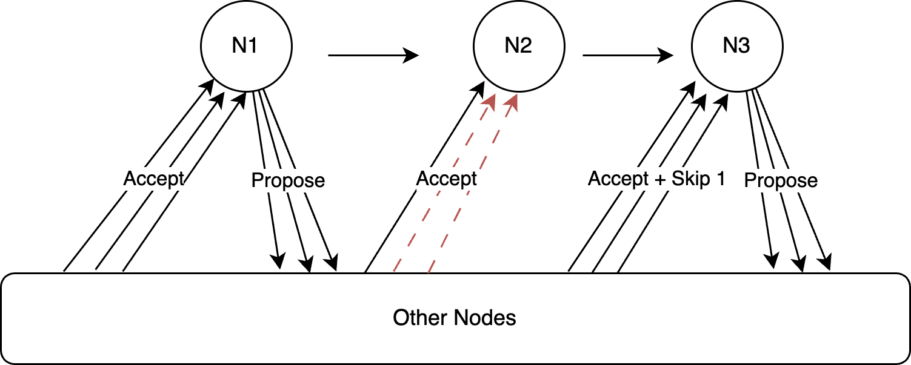
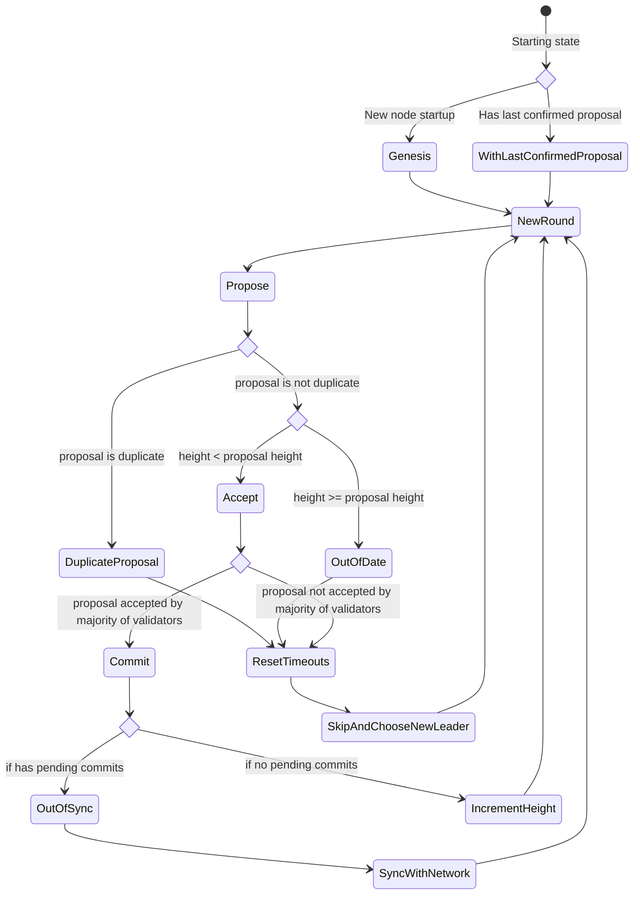

# Solid Consensus Protocol

Protocol for achieving BFT consensus for a given state machine.

## Background

### What is Consensus?

Consensus, in a Distributed System, is a mechanism for converging to an agreement on some state, where the state can be arbitrarily complex. To get a good overview of consensus, refer to this [excellent resource](https://www.youtube.com/watch?v=rN6ma561tak&list=PLeKd45zvjcDFUEv_ohr_HdUFe97RItdiB&index=18).

Consensus protocols are generally classified into two major classifications, based on the nature and mode of failures possible for the nodes of the systems:

  1. Non-BFT, and
  2. BFT

where 'BFT' stands for "Byzantine Fault Tolerance". What exactly is Byzantine Fault Tolerance, and why should we care?

#### Byzantine Fault Tolerance (BFT)

The classic thought experiment that led to the idea of Byzantine Fault Tolerance is the the [Byzantine Generals Problem](https://www.youtube.com/watch?v=LoGx_ldRBU0&list=PLeKd45zvjcDFUEv_ohr_HdUFe97RItdiB&index=5). The gist of it is that nodes in a distributed system
can fail for a variety of reasons - due to network and operational issues, and/or due to deliberate malicious activity on the nodes.

If the node failures in the system are due to non-deliberate failures/malicious activity (such as diverting from the agreed protocol, intentionally appearing offline, colluding with other nodes to subvert the protocol), then such issues are non-BFT. If not, then they are 
classified as BFT.

#### Non-BFT Consensus Protocols

If a consensus protocol can ensure *safety* (meaning that the system comes to a non-ambiguous state through the protocol) and *liveness* (meaning that the system never grinds to a stop, and continues making progress), then such a protocol is termed a "non-BFT" protocol.
Some popular examples are: 

  1. The Paxos family of protocols, and
  2. The Raft protocol.

References for non-BFT protocols:

  * https://medium.com/the-sixt-india-blog/raft-and-paxos-a-brief-introduction-to-the-basic-consensus-protocols-powering-distributed-systems-1a0ef7ca3acb
  * https://raft.github.io/
  * https://www.youtube.com/watch?v=vYp4LYbnnW8

#### BFT Consensus Protocols

Conversely, if a node can **fail** due to deliberate subversion of the protocol of malicious behaviour intended to compromise the system, then consensus protocols which can ensure safety and liveness in such an environment are called BFT protocols.
Some popular examples are:

  1. PBFT (Practical PBFT) - the seminal protocol introduced by Castro & Liskov that showed that such a system was possible with sufficient efficiency, and
  2. The Tendermint protocol, a popular protocol (and SDK) for implementing BFT consensus.

References for BFT protocols:

  * https://docs.tendermint.com/v0.34/introduction/what-is-tendermint.html#consensus-overview
  * https://www.youtube.com/watch?v=AFiLxS7f1Lo
  * https://pmg.csail.mit.edu/papers/osdi99.pdf


## Overview of Solid

`Solid` is a BFT consensus protocol.

Solid minimizes network communication. `accept` messages are sent only to the next designated leader (many to one). Once a leader accumulates `accept` messages from a majority of nodes (including itself), 
it will then propose a new `proposal` to the network (one to many).

If the network detects that no proposal has been received from the network within a given timeout period, then the node will then send an `accept` to the next designated leader, with a `skip` of 1. This process is repeated until a valid proposal is sent from a node.



Solid implements an async event stream interface where relevant events are omitted and it is the responsibility of the implementor to define the network and storage implementations.

The number of nodes should always be an odd number to prevent a deadlock situation where no majority can be reached. This is the *liveness* property alluded to previously.


### Terminology

  * Leader - The node which is in charge of submitting proposals. See [Leader Election](#leader-election)

  * Proposal - a request to add a block with a bunch of transactions to the network.

  * Accepts - message sent by all nodes to the leader indicating acceptance of the previous proposal. Also sent in the case where a leader is skipped since
              it did not produce a proposal in time.

  * Skips - the number of changes of leaders since the last confirmed proposal. A leader is skipped if it does not produce a proposal before timeout.

  * Height - the number of committed blocks on the network. A proposal has an associated height which indicates how updated (or outdated) the node state is.

  * Validators - all the nodes of the system that vote for a proposal to be accepted (so all the available, non-malicious nodes in the system).


### The Solid State Machine



#### State Transitions

### Proposals

#### Accepts

Accepts are sent to the next designated leader in the following scenarios: 
 
  1. When a valid proposal is received from the previous leader (building on the last confirmed proposal)

  2. After a given timeout (in order to move on from nodes that are not online), these are referred to as `skips`

  3. If there are no pending proposals (usually on start up)

Accepts are either for a proposal:
    - confirmed height + 1 (when a valid proposal is received)
    - confirmed height (when no valid pending proposals exist)

### Commits

### Leader Election

Leader election is done for every proposal/accept round (accounting for timeouts) using the following simple formula:

```
 next_leader_id = skips % number_of_peers 

```

So this is **not** a Round-Robin procedure (as in some consensus protocols), but rather depends on the number of current peers (which is fixed at start-up for now), and the number of skips (i.e, since the last confirmed proposal) thus far. 


## Todo
 
 - Add/remove peers from the protocol validators
